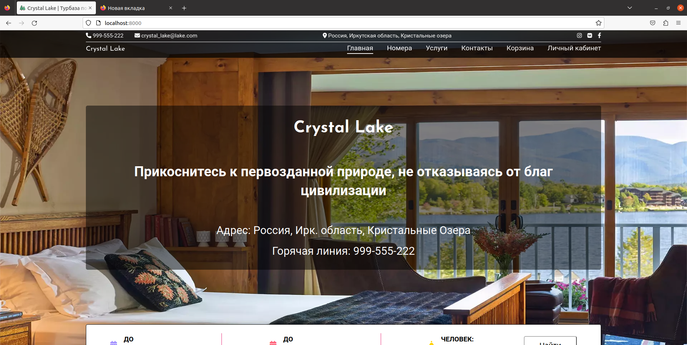

#  Бэкнэд часть сайта Crystal Lake

## Инструкция по запуску:

1) Находясь в папке с проектом создайте .env файл со следующим содержанием:
```bash
DB_NAME=ваше имя базы данных
DB_USER=ваш логин к базе данных
DB_PASSWORD=ваш пароль к базе данных
DB_PORT=ваш порт для базы данных (должен быть свободен)
APACHE_PORT=порт для апачи
KEY=ваш секретный ключ джанго
DEV=запустить ли в режими разработки
CUSTOM_HOST=опциональная настройка кастомного хоста. Если не указывать, то будет использоваться localhost
```
Пример:
```bash
DB_NAME=crystal_lake
DB_USER=user
DB_PASSWORD=passwd
DB_PORT=5454
APACHE_PORT=8000
KEY=@@)*r3&2f0=%t^@bnom9@916(z=3-2e_iqqr90(r_v@foum(q^
DEV=true
```
2) Соберите и запустите контейнеры:
```
docker-compose up --build
```
3) Для создания суперпользователя выполните скрипт [create_superuser.sh](./create_superuser.sh), который первым аргументом принимает номер телефона RU формата, а вторым пароль. Пример:
```
./create_superuser.sh +79999999999 qwe
```

## Описание проекта
Проект создан в учебных целях для ознакомления с основами веб разработки. Отдельно фронтэнд (без использования шаблонизатора django) часть находится в данном репозитории - https://github.com/SergeiGD/Crystal-Lake-frontend *(p.s. некоторые моменты могут незначительно отличаться в связи с измениями в бизнес логике и отсутвия реализации некоторых фич)*

В данном проекта реализована система управления тур базой. В клиентской части сайта пользователь может просматривать каталог предоставляемых услуг (бронирование номеров и развлекательных услуг, на подобие рыбки, езды верхом и т.п.), добавлять интересующие его предложения в корзину и оформлять на них заказ, пройти регистрацию, авторизироваться, управлять своими заказами в личном кабинете. В админ части сайта сотрудники могут изменять, добавлять, удалять сущности, используемые в системе.

**Использованые технологии бэкдэнд часть:**
- python 3.9
- Django 4.1.3
- PostgreSQL
- Apache

**Использованые технологии фронтэнд часть:**
- HTML 5
- CSS 3
- SCSS
- JS (JQuery)
- Webpack
- Bootstrap 5 (для админ-части сайта)

**Дополнительные использованные технологии**
- Docker
- Docker-compose
- schema org
- json ld
- open graph

## Скриншоты и описание клиентской части

На главной странице предоставлена основаня информация о турбазе и несколько предложений по бронированию номеров и услуг.


На странице номера/услуги предостален перечен соотвествующих предложений с возможностью поиска и сортировка


При переходе на интересующее предложение клиент видит описание номера, свободные даты бронирования, форму добавления предложения в корзину и похожие предложения


В корзине представлен список элементов, добавленных в нее и кнопки оплаты, которые подтвержают заказ (реальной оплаты не происходит)


В личном кабинете клиент может просмотреть свои активные заказа и изменить их


Также в личном кабинете он может просмотреть свою историю заказов (аналогично активным заказам, но без возможности изменения) и изменить свои контактые данные


Для доступа в личный кабинет клиент должен авторизироваться, предварительно пройдя регистрацию. 
*p.s. реально смс в кодом не отправлятся, вместо этого она записывается в файл [sms_codes](./crystallake/sms_codes.txt)


## Оптимизация сайта
Все css и js файлы в режиме продакшена идут в минимизированном (сжатом формате), также на них настроен cache control продолжительностью ~ месяц.
Для ускорения скорости отображения главной страницы, на ней присуствует critical css, чтоб показывать первый скролл как можно скорее. 
Результаты теста google page speed:


На всех основных страницах клиентской части сайта присутствует разметка schema org для оптимизации работы поисковых систем


